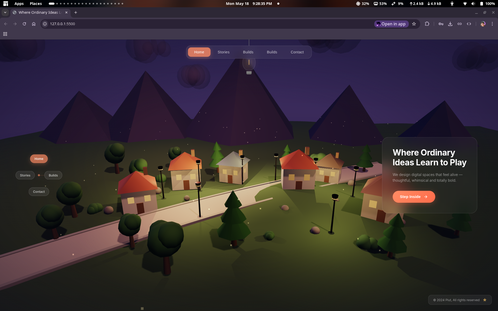
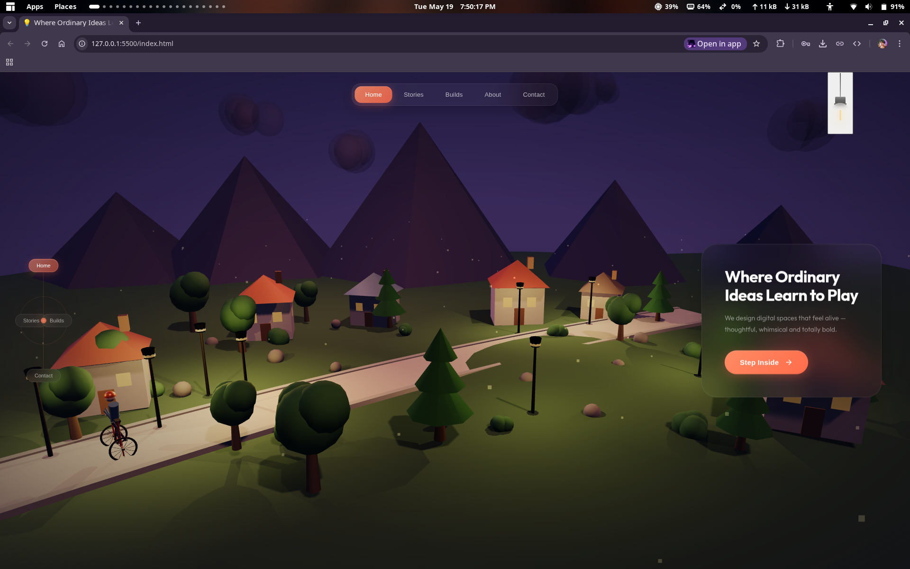
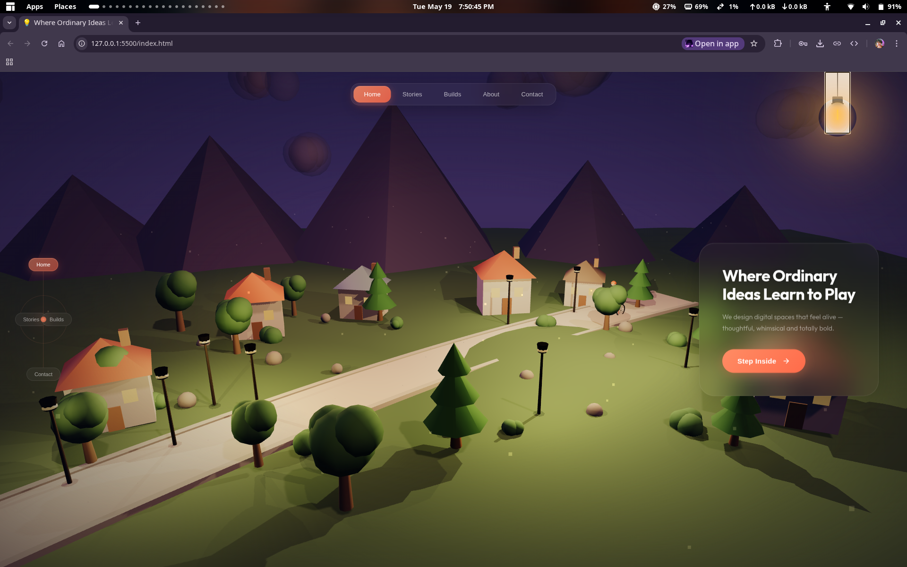

<div align="center">

# 🏘️ Miniature Town Landing Page

> ✨ An immersive 3D animated landing page — warm atmospheric vibes, dynamic weather, lightning storms & floating glass UI.



</div>

---

## 📸 Screenshots

<table>
  <tr>
    <td align="center"><strong>🧭 Navigation Detail</strong><br></td>
    <td align="center"><strong>💡 Lightbulb Interaction</strong><br></td>
  </tr>
</table>

---

## 🚀 Features

| Feature | Description |
|---|---|
| 🏡 **3D Miniature Town** | Houses, trees, street lamps, mountains & clouds in Three.js |
| 🚴 **Animated Cyclist** | Hierarchical character with realistic pedaling & limb animation |
| 🌅 **Warm Atmosphere** | Warm ambient, directional, fill & rim lights with ACES tone mapping |
| 🪟 **Interactive UI** | Glassmorphism nav, floating hero card, orbital node nav & clickable lightbulb |
| ✨ **Firefly + Spark Particles** | Ambient floating fireflies + warm sparks around the lightbulb |
| 🔄 **360° Auto-Rotation** | Camera orbits the full scene continuously with smooth looping |
| 🖱️ **Mouse Parallax** | Cursor adds subtle offset to the orbiting camera for depth |
| ⛈️ **Lightning Clouds** | Dark storm cloud with intermittent lightning flashes & screen-wide glow |
| 🌧️ **Warm Rain** | Hundreds of warm-tinted rain particles with gravity & wind drift |
| 💨 **Warm Wind** | Flowing wind streaks that affect rain, sparks & tree sway |
| 🌊 **Gentle Camera Bob** | Subtle vertical oscillation for a living, breathing feel |

---

## 🛠️ Tech Stack

```
┌─────────────────────┬──────────────────────────────────────┐
│  🎨 Three.js r128   │  3D scene rendering                  │
│  📄 HTML5           │  Structure & semantic markup         │
│  🎭 CSS3            │  Glassmorphism, animations, responsive│
│  ⚡ JavaScript ES6+ │  Scene logic, animations, interactions│
└─────────────────────┴──────────────────────────────────────┘
```

---

## 📁 Project Structure

```
LANDING PAGE/
│
├── 📄 index.html          # Main HTML structure + overlays
├── 🎨 style.css           # All UI styling, animations & weather overlays
├── ⚙️  script.js           # Three.js scene, models, weather & animation loop
├── 🖼️  image/              # Screenshots & assets
│   ├── screenshot-hero.png
│   ├── screenshot-nav.png
│   └── screenshot-bulb.png
└── 📖 README.md           # Project documentation
```

---

## 🏃‍♂️ Getting Started

### ⚡ Quick Start

```bash
cd "LANDING PAGE" && python3 -m http.server 8080
```

Then open → **http://localhost:8080**

### 📋 Prerequisites

- ✅ Any modern browser (Chrome, Firefox, Safari, Edge)
- ✅ A local HTTP server (required for Three.js)

---

## 🎮 Interactions

| Element | Action | Effect |
|---|---|---|
| 💡 **Lightbulb** | `Click` | Toggle warm scene glow + sparks |
| 🧭 **Nav Pills** | `Click` | Switch active section |
| ⚫ **Node Dots** | `Click` | Navigate sections |
| 🔘 **CTA Button** | `Hover` | Glow + lift effect |
| 🖱️ **Mouse Move** | `Move` | Parallax offset on orbiting camera |
| 🔄 **Camera** | `Auto` | Continuous 360° rotation |

---

## 🎨 Design System

```css
🔤 Font          → Outfit (300–700)
🎨 Accent        → #ff8c64 → #ff6b4a gradient
🪟 Glass Effect  → backdrop-filter: blur(20-32px)
🌑 Background    → #1a1228 warm dark purple
📝 Text          → White, opacity 0.4–0.9
🌫️ Fog           → FogExp2(0x2a1a2e, 0.012)
💡 Tone Mapping  → ACESFilmic, exposure 1.0
```

---

## 👨‍💻 Developer

<div align="center">

**Willy Jr Carnasa Gailo**

</div>

---

<div align="center">

📄 © 2026 Piut — All rights reserved.

</div>
